<div align="center">

# ⛏️ CoalTrack

### **Absensi anti-curang** untuk perusahaan tambang batu bara — *Coal Mine Attendance*

Dibangun untuk **Qubah Group** · Laravel · Vue · Flutter

**[▶ Buka Showcase (live)](https://ksatriabintangsamudra.my.id/coaltrack-showcase/)** — per-slide presentation · **5 languages** via the flag switcher (top-right) · English default

</div>

> ℹ️ Ini repositori **showcase/portofolio** (publik). **Kode sumber lengkap bersifat privat** agar mudah dikembangkan.

---

## 📱 Aplikasi mobile (Flutter) — tangkapan layar asli

| Beranda | Absen ⭐ | Riwayat | Profil & Tema |
|:---:|:---:|:---:|:---:|
| 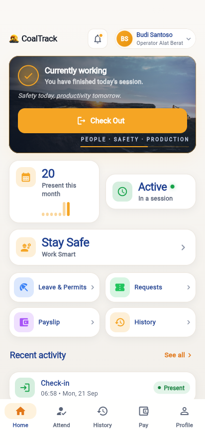 | 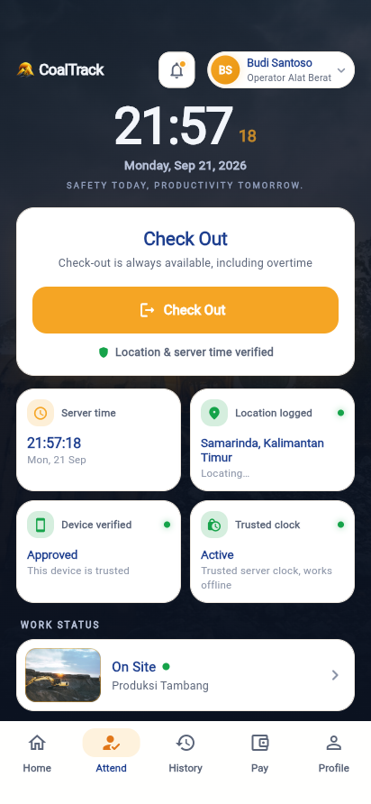 | 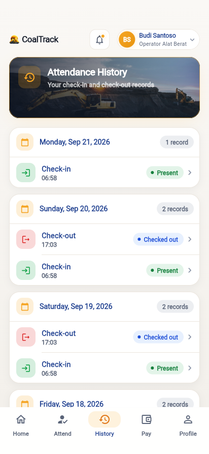 | 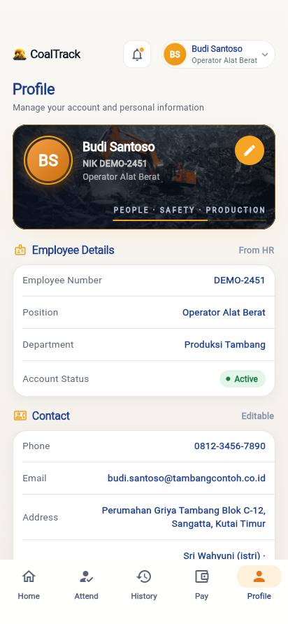 |
| Status hadir/bekerja + aktivitas | Verifikasi wajah + liveness | Per hari + status keputusan | Info, perangkat, terang/gelap |

Alur absen 2 ketukan: **ketuk → verifikasi wajah (liveness) → hasil**. Waktu ditentukan **server**, media wajah dibungkus & dikirim aman. Satu aplikasi, **dua permukaan** (karyawan vs admin/HR) dipilih otomatis dari peran; sesi bertahan.

### 🌙 Beautiful dark mode & 🌐 5 languages (EN · ID · MS · ZH · AR)

| Beranda · Gelap | Absen · Gelap | Bahasa & Tema | English |
|:---:|:---:|:---:|:---:|
| 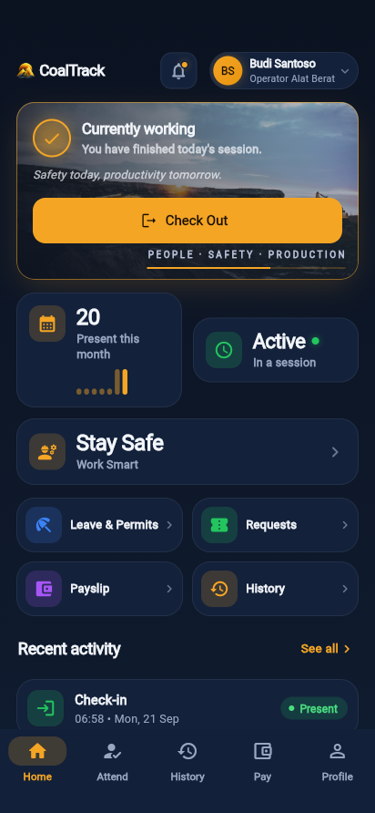 | 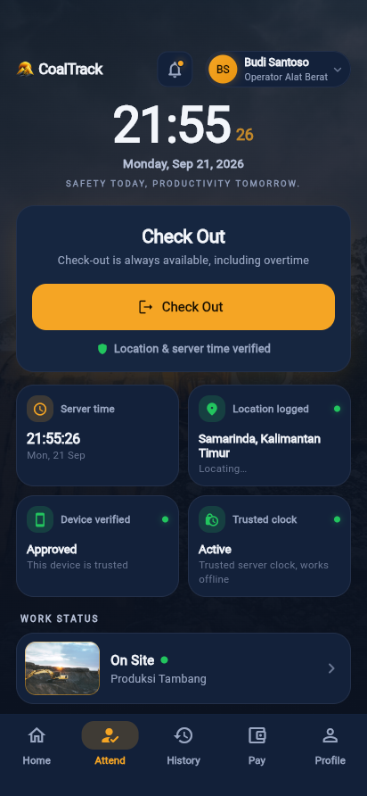 | 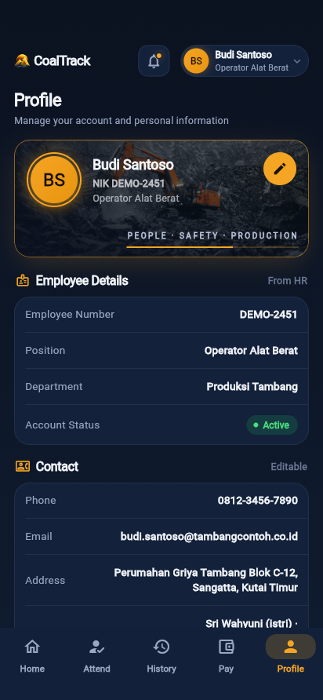 | 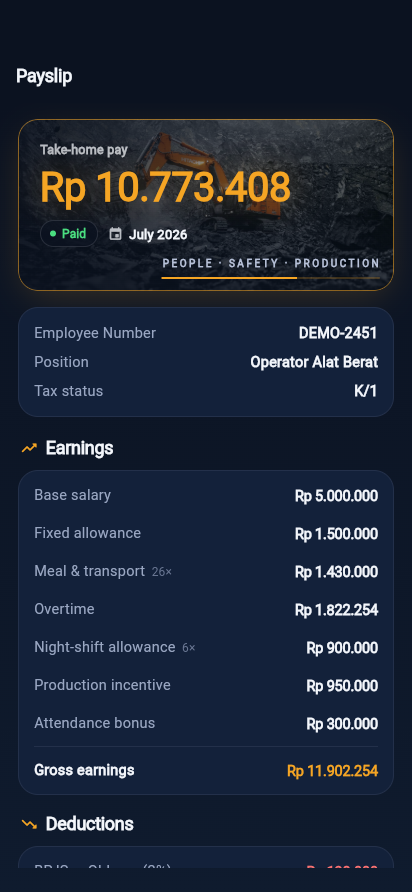 |

Setiap layar dirancang untuk **terang & gelap** (navy dalam + aksen hijau daun & emas), antarmuka penuh **Bahasa Indonesia & English** yang bisa diganti kapan saja — termasuk format tanggal & waktu.

### 🧾 Slip Gaji — penggajian otomatis dari absensi

| Tab Gaji | Slip · Terang | Slip · Gelap | Splash |
|:---:|:---:|:---:|:---:|
| 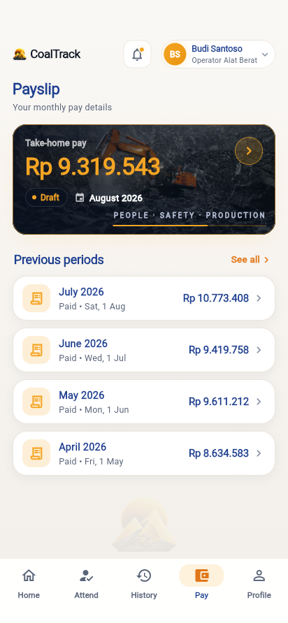 | 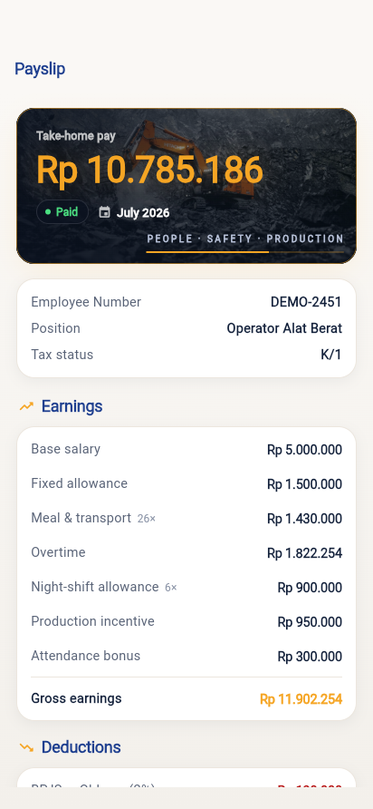 |  | 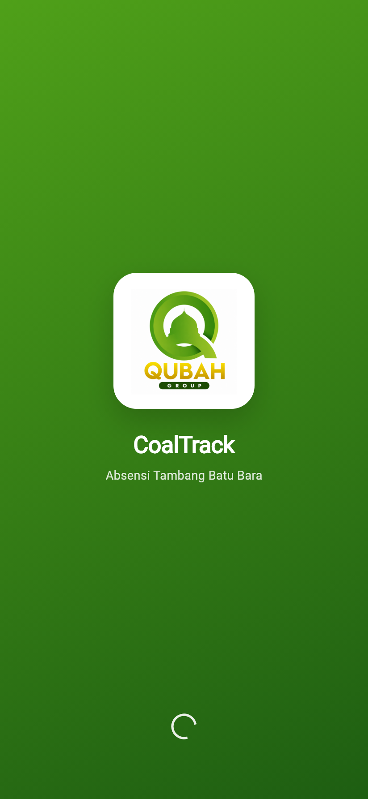 |

Setiap angka **benar-benar dihitung** oleh engine penggajian (bukan contoh statis): gaji pokok, tunjangan, **lembur (Kepmenaker 102/2004)**, insentif → **potongan BPJS TK (JHT/JP) & Kesehatan, PPh21 metode TER** → **gaji dibawa pulang**. Engine yang sama berjalan di **server (Laravel)** dan **aplikasi (Flutter)** — teruji **20 tes** dengan hasil **identik lintas-platform**.

### 📝 Fitur karyawan lengkap & 🖥️ ruang kendali admin

| Izin & Cuti | Notifikasi | Atur Profil | Dashboard | Monitor real-time |
|:---:|:---:|:---:|:---:|:---:|
| 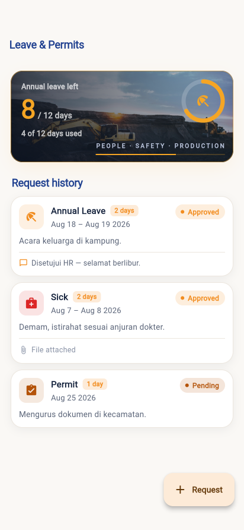 | 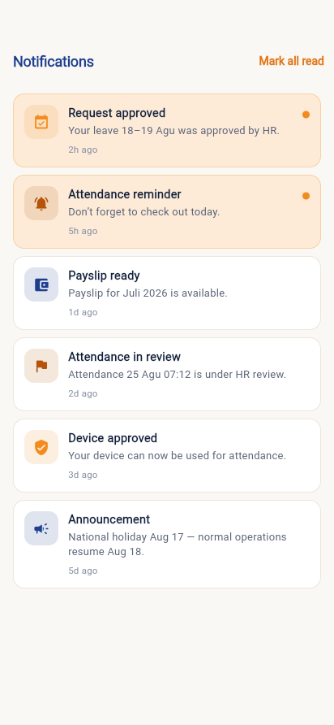 | 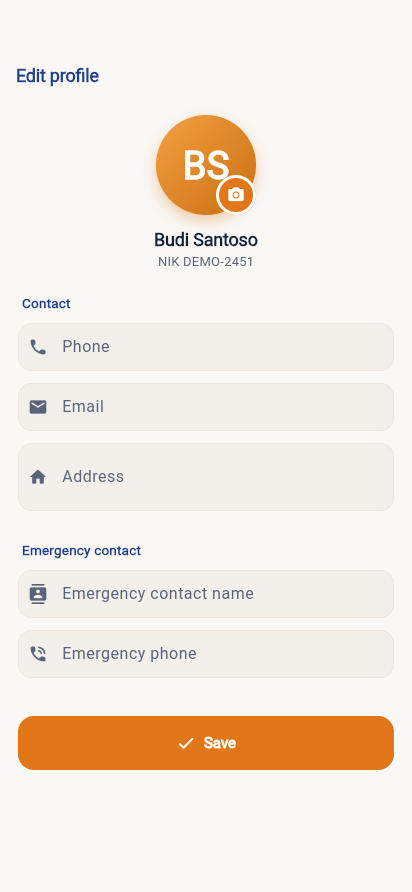 | 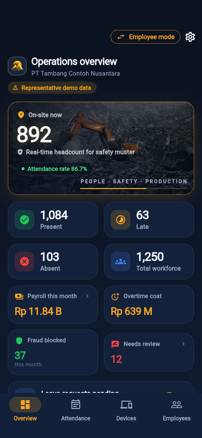 | 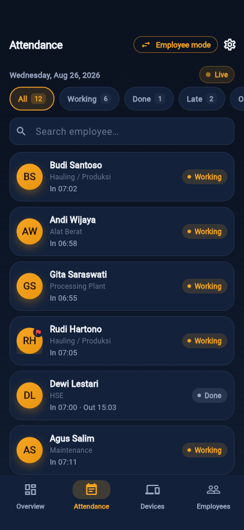 |

Karyawan **ajukan izin/cuti/sakit** (dengan sisa kuota & lampiran), terima **notifikasi**, dan **atur profil** (foto + kontak darurat) sendiri — tanpa ke kantor HR. Pimpinan/HR pantau **kehadiran real-time**: siapa di lokasi, biaya payroll, dan **kecurangan tertahan** (lokasi palsu langsung tampak).

**Operasi HR lengkap** — perangkat, karyawan, penggajian, dan persetujuan:

| Perangkat | Karyawan | Payroll Run | Slip PDF | Persetujuan Izin |
|:---:|:---:|:---:|:---:|:---:|
| 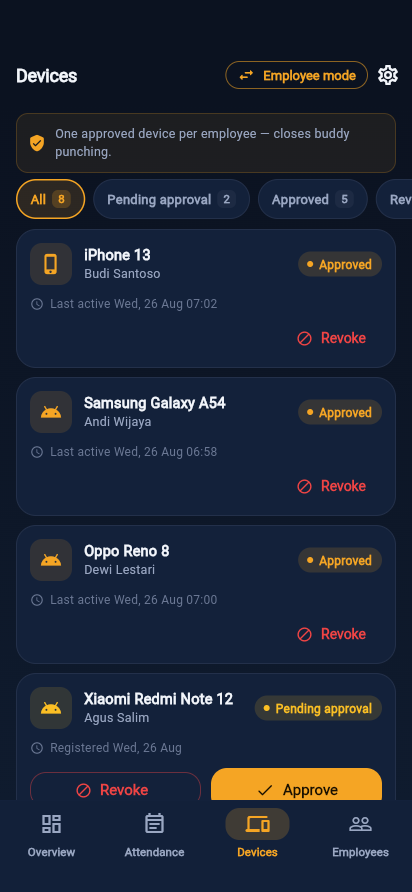 | 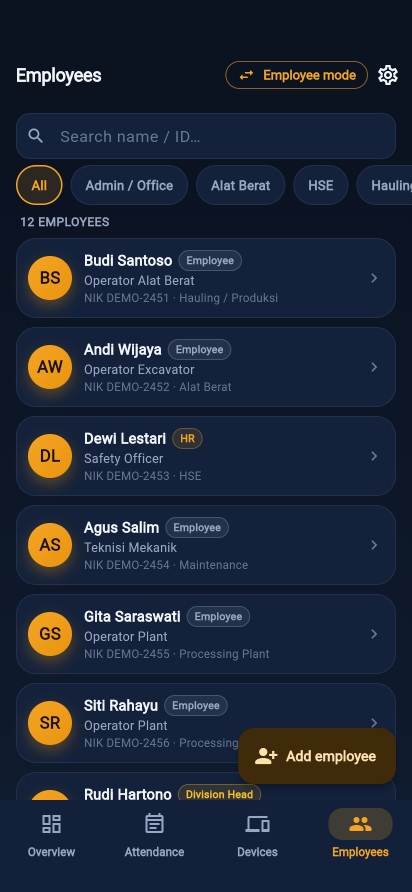 | 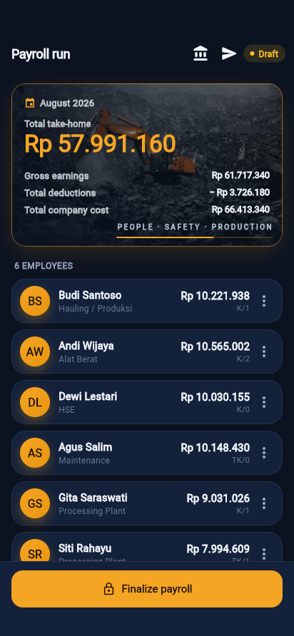 | 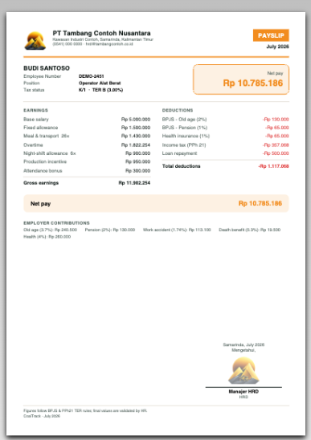 | 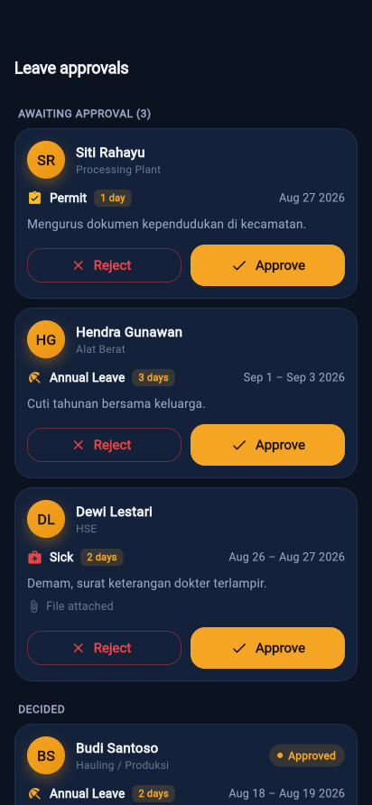 |

**1 perangkat disetujui/karyawan** (setujui/cabut), direktori karyawan (cari/NIK/dept), **payroll run → finalisasi → bayar** dengan **slip gaji PDF** (kirim ke tiap karyawan lewat **Telegram/Email**), dan **persetujuan izin/cuti** — semua dari genggaman.

## 🔒 Inti produk — menutup celah kecurangan absensi

- **Waktu otoritatif server** — keputusan pakai waktu server, bukan jam HP → manipulasi jam HP tertutup total.
- **Pengikatan perangkat** — 1 perangkat disetujui per karyawan (persetujuan admin) → menutup titip absen.
- **Catatan immutable + audit** — event absensi append-only (trigger DB); pembatalan HR tercatat, riwayat tak dipalsukan.
- **Mesin keputusan** — terima/tolak/tandai berbasis bukti, prinsip *gagal ke arah aman*.
- **Wajah + liveness** — verifikasi dengan anti-spoofing (continuity + presentation-attack detection).
- **GPS = audit, bukan gerbang** — **lokasi GPS asli perangkat** (real-time saat absen) + **deteksi mock-location**; lokasi kerja tersebar, atestasi perangkat direkam. Kegagalan izin tidak memblokir absen.

## 🧾 Payroll (HRIS) — gaji otomatis dari absensi

- **Lembur** rumus Depnaker (1,5× / 2×), tunjangan **shift malam** & **insentif produksi**
- **BPJS** Ketenagakerjaan (JHT/JP/JKK/JKM) & **BPJS Kesehatan**
- **PPh21 metode TER 2024** + rekonsiliasi Desember (tarif *parameterized*)
- Kasbon/pinjaman, potongan alpha, **slip gaji PDF**
- Payroll run **draft → finalize (immutable) → paid**, koreksi teraudit

## 🏗️ Arsitektur

```
📱 Mobile Flutter  ─┐
                    ├─→  🔌 API Laravel 12 (Sanctum)  ─→  🗄️ PostgreSQL 16 (event append-only)
🖥️ Web Vue 3       ─┘

Absensi (otoritatif, immutable) → Work Sessions → Shift/Roster → Engine Payroll → Slip Gaji
```

## 🛠️ Teknologi

**Backend** PHP 8.3 · Laravel 12 · PostgreSQL 16 · Sanctum · Pest (**207 tes lulus**) · Docker
**Web** Vue 3 · Vite · Tailwind · Pinia
**Mobile** Flutter · Riverpod · go_router · dio · secure_storage

## 🚦 Status

| Bagian | Status |
|---|---|
| Backend + API (model anti-curang, 207 tes) | ✅ selesai |
| Web app (portal karyawan + admin/HR) | ✅ selesai |
| Mobile — karyawan (Absen, Riwayat, **Gaji**, **Izin & Cuti**, **Notifikasi**, Profil+foto) + **GPS real** | ✅ selesai |
| Payroll — engine (server + mobile) & slip gaji, **20 tes** | ✅ selesai |
| Admin — **Dashboard**, **Monitor real-time**, **Perangkat**, **Karyawan** | ✅ selesai |
| Payroll **run → finalize → bayar**, **slip PDF**, kirim slip (Telegram/Email) | ✅ selesai |
| **Persetujuan izin/cuti** (HR) | ✅ selesai |
| Push FCM (notifikasi HP) & ML wajah (liveness) | → berikutnya |

---

<div align="center"><sub>Showcase teknis oleh <a href="https://ksatriabintangsamudra.my.id">Ksatria Bintang Samudra</a> · kode sumber bersifat privat</sub></div>
