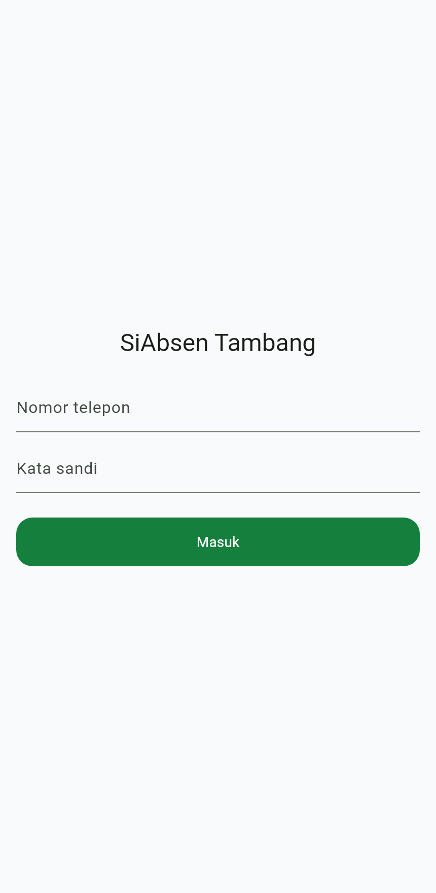
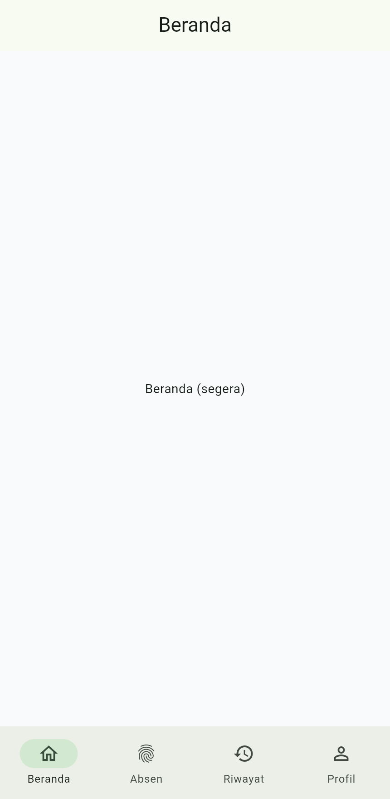
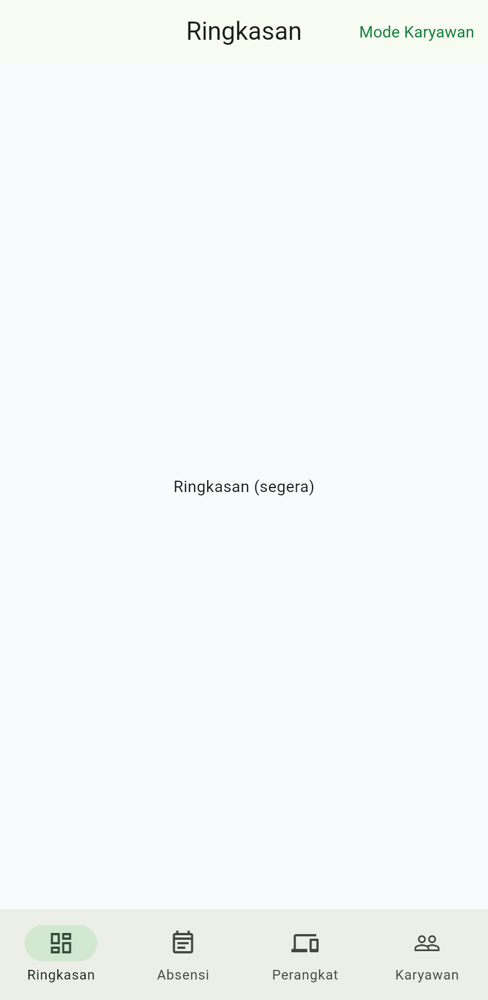

<div align="center">

# ⛏️ SiAbsen Tambang

### HRIS **Absensi anti-curang + Penggajian (Payroll)** untuk perusahaan tambang batu bara

Dibangun untuk **PT Kalimantan Tambang Mandiri** · Laravel · Vue · Flutter

**[▶ Buka Showcase (live)](https://ksatriabintangsamudra.my.id/siabsen-tambang-showcase/)**

</div>

> ℹ️ Ini repositori **showcase/portofolio** (publik). **Kode sumber lengkap bersifat privat** agar mudah dikembangkan.

---

## 📱 Aplikasi mobile (Flutter) — tangkapan layar asli

| Masuk | Mode Karyawan | Mode Admin / HR |
|:---:|:---:|:---:|
|  |  |  |
| Login aman (Sanctum + device binding) | Beranda · Absen · Riwayat · Profil | Ringkasan · Absensi · Perangkat · Karyawan |

Satu aplikasi, **dua permukaan** dipilih otomatis dari peran (`is_admin`). Tema hijau/putih sesuai identitas perusahaan, dukungan mode gelap, sesi bertahan.

## 🔒 Inti produk — menutup celah kecurangan absensi

- **Waktu otoritatif server** — keputusan pakai waktu server, bukan jam HP → manipulasi jam HP tertutup total.
- **Pengikatan perangkat** — 1 perangkat disetujui per karyawan (persetujuan admin) → menutup titip absen.
- **Catatan immutable + audit** — event absensi append-only (trigger DB); pembatalan HR tercatat, riwayat tak dipalsukan.
- **Mesin keputusan** — terima/tolak/tandai berbasis bukti, prinsip *gagal ke arah aman*.
- **Wajah + liveness** — verifikasi dengan anti-spoofing (continuity + presentation-attack detection).
- **GPS = audit, bukan gerbang** — lokasi kerja tersebar; deteksi lokasi palsu & atestasi perangkat direkam.

## 🧾 Payroll (HRIS) — gaji otomatis dari absensi

- **Lembur** rumus Depnaker (1,5× / 2×), tunjangan **shift malam** & **insentif produksi**
- **BPJS** Ketenagakerjaan (JHT/JP/JKK/JKM) & **BPJS Kesehatan**
- **PPh21 metode TER 2024** + rekonsiliasi Desember (tarif *parameterized*)
- Kasbon/pinjaman, potongan alpha, **slip gaji PDF**
- Payroll run **draft → finalize (immutable) → paid**, koreksi teraudit

## 🏗️ Arsitektur

```
📱 Mobile Flutter  ─┐
                    ├─→  🔌 API Laravel 12 (Sanctum)  ─→  🗄️ PostgreSQL 16 (event append-only)
🖥️ Web Vue 3       ─┘

Absensi (otoritatif, immutable) → Work Sessions → Shift/Roster → Engine Payroll → Slip Gaji
```

## 🛠️ Teknologi

**Backend** PHP 8.3 · Laravel 12 · PostgreSQL 16 · Sanctum · Pest (**207 tes lulus**) · Docker
**Web** Vue 3 · Vite · Tailwind · Pinia
**Mobile** Flutter · Riverpod · go_router · dio · secure_storage

## 🚦 Status

| Bagian | Status |
|---|---|
| Backend + API (model anti-curang, 207 tes) | ✅ selesai |
| Web app (portal karyawan + admin/HR) | ✅ selesai |
| Mobile — fondasi & auth (Flutter) | ✅ selesai |
| Payroll (penggajian) | ◐ desain lengkap |
| Fitur karyawan lanjutan & ML wajah | → berikutnya |

---

<div align="center"><sub>Showcase teknis oleh <a href="https://ksatriabintangsamudra.my.id">Ksatria Bintang Samudra</a> · kode sumber bersifat privat</sub></div>
