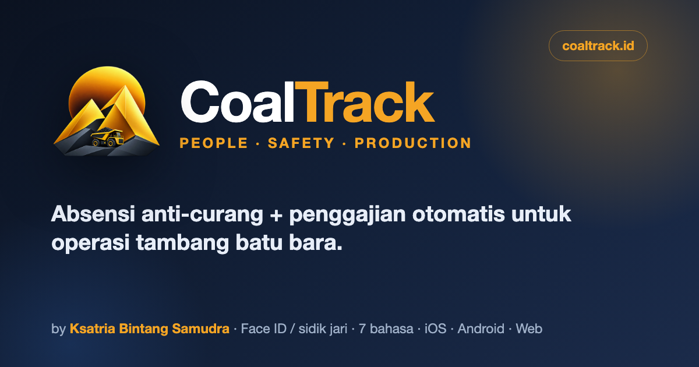
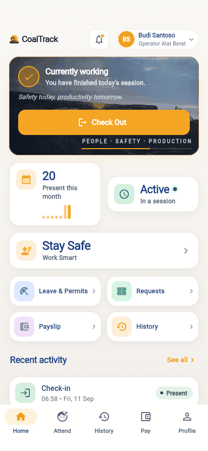
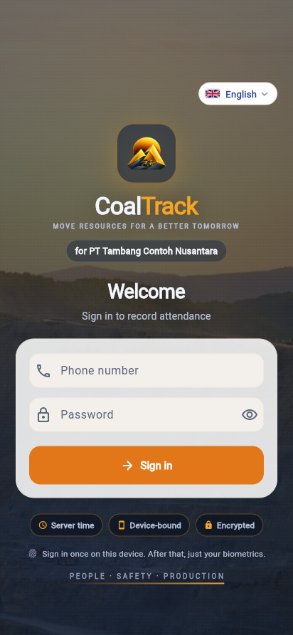
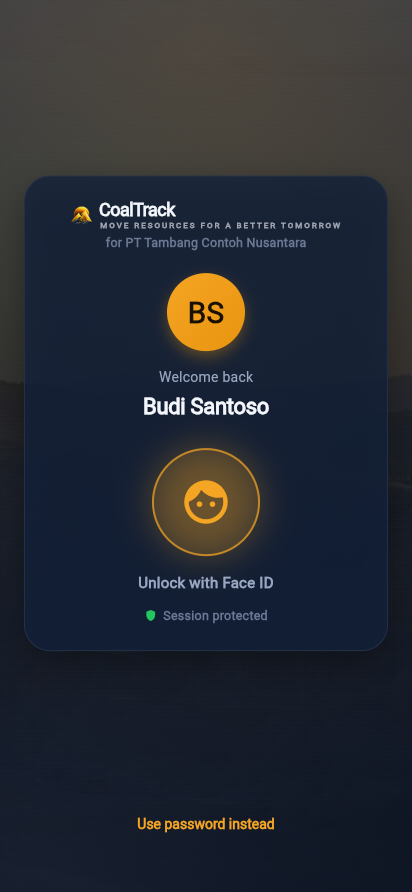
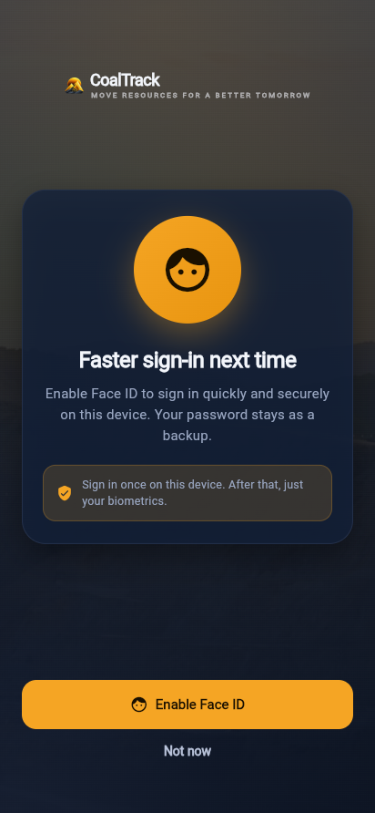

<div align="center">



<h1>⛏️ CoalTrack</h1>

<h3>Anti-fraud attendance + automatic payroll for coal-mining operations</h3>

<p>


</p>
<p>


</p>

<p><b>Built for <a href="https://ksatriabintangsamudra.my.id">Qubah Group</a></b></p>

<h3><a href="https://ksatriabintangsamudra.my.id/coaltrack-showcase/">▶ Open the live showcase</a></h3>

<p><em>Per-slide presentation · flag switcher for <b>5 languages</b> (top-right) · English default · full RTL</em></p>

<br>



</div>

> ℹ️ This is the **public showcase / portfolio** repository. **The full source code is private** to keep it easy to evolve.

---

## ✨ What it does

**CoalTrack turns honest attendance into accurate payroll — automatically.** Employees clock in with **face + real GPS** in two taps; the server decides on **immutable, tamper-proof** rules; verified hours flow straight into a **compliant payroll engine** (BPJS, PPh21 TER, overtime) that produces a **PDF payslip**. One Flutter app for **iOS & Android**, a **Laravel** API, and a **Vue** HR portal.

| 🛡️ Anti-fraud | 🙂 Face + liveness | 📍 Real GPS | 🔐 Biometric login | 🌐 5 languages | ✅ 207 tests |
|:---:|:---:|:---:|:---:|:---:|:---:|

---

## 👥 Two roles, one app

The app opens the right surface automatically from the signed-in role — no separate apps.

| 👤 **Employee** — *records their own attendance* | 🛡️ **Admin / HR** — *controls & monitors everything* |
|:---|:---|
| ✓ Face + GPS attendance (2-tap, server time) | ✓ Operations dashboard (on-site headcount, cost) |
| ✓ Attendance history + decision status | ✓ Real-time monitor (present/late, mock-GPS flags) |
| ✓ Payslip (breakdown + PDF) | ✓ Leave approvals (approve / reject + reason) |
| ✓ Leave & permits (+ remaining quota) | ✓ Device management (1 phone / employee) |
| ✓ Notifications | ✓ Employee directory (search, filter) |
| ✓ Profile & theme (5 languages) | ✓ Payroll run → pay → PDF slip → Telegram/Email |

---

## 🔐 Security — sign in once, then just your face or finger

| First sign-in | Face ID / fingerprint | One-tap enable |
|:---:|:---:|:---:|
|  |  |  |

First login uses a **password** on the device; after that **Face ID / Touch ID (iOS)** or **fingerprint / face-unlock (Android)** — adapting to each phone via `local_auth`. Sessions are **encrypted** (`flutter_secure_storage`), **device-bound** (1 phone per employee), and re-lock automatically when the app is backgrounded. **Screenshots are blocked** on sensitive screens (Android `FLAG_SECURE` + iOS app-switcher blur).

### The six layers that close the fraud gaps

**Server time** · **Device binding** · **Immutable append-only log** · **Face + liveness** · **Real GPS + mock detection** · **Evidence-based decision engine** *(fails safe)*.

---

## 🆚 Manual / Excel vs CoalTrack

| Aspect | Manual / Excel | CoalTrack |
|---|---|---|
| Attendance time | ✕ Phone clock, manipulable | ✓ **Server time, tamper-proof** |
| Buddy-punching | ✕ Undetected | ✓ **Face + 1 phone/employee** |
| Payroll recap | ✕ Days of manual work, error-prone | ✓ **Automatic from attendance** |
| Reporting | ✕ Monthly, late | ✓ **Real-time** |
| Tax & BPJS | ✕ Manual, error-prone | ✓ **PPh21 TER + BPJS automatic** |
| Cost leakage | ✕ ~Rp 7.47 B / year | ✓ **Closed** |

---

## 📱 The app

| Home | Attend ⭐ | History | Payslip |
|:---:|:---:|:---:|:---:|
|  |  |  |  |

| Leave & permits | Notifications | Edit profile | Beautiful dark mode |
|:---:|:---:|:---:|:---:|
|  |  |  |  |

### 🖥️ The control room — Admin / HR

| Dashboard | Live monitor | Devices | Employees |
|:---:|:---:|:---:|:---:|
|  |  |  |  |

---

## 🔄 From clock-in to payslip — one pipeline

```
📲 Attendance  ─▶  🖥️ Server decision  ─▶  ⏱️ Work session  ─▶  🧮 Payroll engine  ─▶  🧾 Payslip
 face + GPS         server time,            verified hours       overtime, BPJS,        PDF + Telegram
 2 taps             immutable log           per day              PPh21 TER              / Email
```

Honest attendance feeds accurate payroll — **no manual recaps, no gaps**.

---

## 🏗️ Architecture

```
📱 Flutter (employee + admin)  ─┐
                                ├─▶  🔌 Laravel 12 API (Sanctum)  ─▶  🗄️ PostgreSQL 16 (append-only)
🖥️ Vue 3 (HR portal)          ─┘

Attendance (authoritative, immutable) → Work sessions → Shift/Roster → Payroll engine → Payslip
```

**Backend** PHP 8.3 · Laravel 12 · PostgreSQL 16 · Sanctum · Pest (**207 tests**) · Docker
**Web** Vue 3 · Vite · Tailwind · Pinia
**Mobile** Flutter · Riverpod · go_router · dio · local_auth · flutter_secure_storage

---

## 🚦 Status

| Area | Status |
|---|---|
| Backend + anti-fraud API (207 tests) | ✅ done |
| Web portal (employee + admin/HR) | ✅ done |
| Mobile employee (attend, history, pay, leave, notifications, profile) + **real GPS** | ✅ done |
| **Biometric login** (Face ID / fingerprint) + app-wide screenshot protection | ✅ done |
| Payroll engine (BPJS, PPh21 TER, overtime) + PDF payslip · **20 tests** | ✅ done |
| Admin (dashboard, live monitor, devices, employees) | ✅ done |
| Payroll run → pay + PDF slip · Telegram/Email delivery | ✅ done |
| Leave approvals (HR) | ✅ done |
| FCM push & face-ML liveness | → next |

---

<div align="center"><sub>Technical showcase by <a href="https://ksatriabintangsamudra.my.id">Ksatria Bintang Samudra</a> · source code is private</sub></div>
