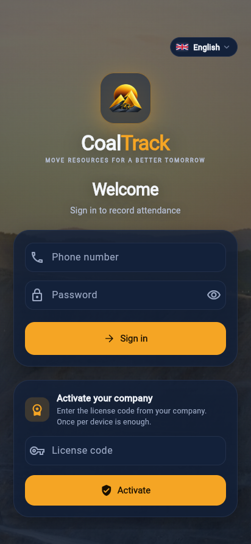
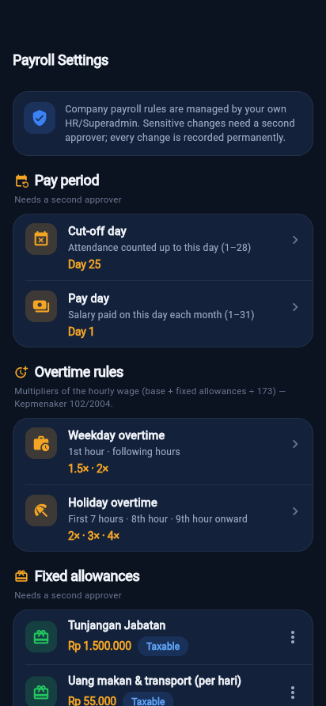
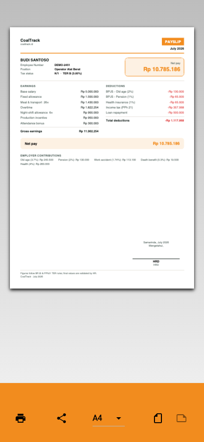

<div align="center">


# CoalTrack

### Anti-fraud attendance + automatic payroll for coal-mining operations

<p>
<a href="https://coaltrack.id"></a>
<a href="https://demo.coaltrack.id"></a>
</p>

<p>


</p>
<p>


</p>

**A product of Ksatria Bintang Samudra**


</div>

> **This is the public showcase / portfolio repository.** It contains the marketing deck at
> [coaltrack.id](https://coaltrack.id) and its screenshots. **The application source code is private.**

---

## What CoalTrack does

Attendance recaps in a mining operation are usually a spreadsheet problem: the phone clock can be
changed, a friend can clock in for you, and by the time payroll is assembled nobody can prove what
really happened. CoalTrack closes that loop end to end.

A worker clocks in with **face verification + real GPS** in two taps. The **server** decides — using
the server clock, not the phone — and writes an **append-only** event that nobody can edit later.
Verified hours roll into **work sessions**, work sessions into a **payroll engine** that computes
overtime, BPJS and **PPh21 TER**, and the engine produces a **PDF payslip** that is emailed to the
employee and pushed to Telegram. Management watches all of it in real time.

One Flutter app for iOS, Android and Web (employee + admin surfaces), a Laravel API, a Vue HR portal.

---

## Key features

### Anti-fraud attendance — six layers

| | Layer | What it closes |
|---|---|---|
| 1 | **Server time** | Decisions use the server clock. Changing the phone clock does nothing. |
| 2 | **Device binding** | One approved device per employee. Buddy-punching from a colleague's phone is blocked. |
| 3 | **Immutable log** | Attendance events are append-only (enforced by a DB trigger). History cannot be rewritten. |
| 4 | **Face + liveness** | Face verification with anti-spoofing; the evidence media is stored with the event. |
| 5 | **Real GPS, mandatory** | Real device location with mock-location detection. Recorded as audit evidence. |
| 6 | **Decision engine** | Accept / reject / flag on the evidence — and it fails safe. |

Attendance also works **offline**: the photo, GPS coordinate and satellite time are captured and
queued on the phone, then synced the moment signal returns and reviewed by the team head.

### Payroll

- Payslips computed from verified attendance — **BPJS**, **PPh21 TER**, overtime, allowances,
  cut-off and pay date, all configurable per company.
- Identical results on the server and in the app, covered by dedicated tests.
- **PDF payslip** with letterhead and signature — download, print, or send.
- **Bank transfer file** generated for the company's own cash-management portal.
- **Four-eyes governance**: HR prepares the run → Director/Finance approves → only then is the
  transfer file released. Sensitive changes need a second approver and apply from the next period.
- **Audit trail** on every change (who, when, old → new, and the reason) — not deletable, exportable
  for auditors. Anomaly checks (duplicate bank accounts, paid-with-no-attendance, abnormal overtime)
  run before pay day.
- Money never passes through CoalTrack. Funds leave the company's own bank account.

### Payslip delivery — email on your own domain

CoalTrack includes a transactional email pipeline that sends from the **company's own authenticated
domain** (SPF, DKIM, DMARC), so payslips land in the inbox rather than the spam folder and cannot be
forged. Each employee receives a clean HTML letter with the official **PDF payslip attached**; HR is
notified when a run has finished sending, and every send is logged per employee with retry. Send a
single slip or an entire payroll run — queued, and within the daily sending limit. Email runs
alongside in-app download/print and Telegram delivery.

### Roles, teams and tenancy

- **Employee** — attendance, history, payslip, leave & permits, notifications, profile & theme.
- **Division head** — real-time monitor and approvals for their own team only.
- **HR** — visibility across divisions, escalations, payroll runs.
- **Super-admin** — full control of the organisation and its settings.
- **Multi-tenant, licensed** — one deployment serves several companies with isolated data, each on
  its own licence and its own configuration.

### Everywhere, in 7 languages

English, Indonesian, Malay, Chinese, Arabic (full RTL), Thai and Filipino — switchable at any time,
in the app and on this showcase. Every screen is designed for both light and dark mode.

---

## Screens

| Home | Attend | History | Payslip |
|:---:|:---:|:---:|:---:|
|  |  |  |  |

| Leave & permits | Notifications | Edit profile | Dark mode |
|:---:|:---:|:---:|:---:|
|  |  |  |  |

**Admin / HR control room**

| Dashboard | Live monitor | Devices | Employees |
|:---:|:---:|:---:|:---:|
|  |  |  |  |

**Sign in once, then just your face or finger**

| First sign-in | Face ID / fingerprint | One-tap enable |
|:---:|:---:|:---:|
|  |  |  |

**Licensing &amp; payroll governance**

| Licence activation | Payroll settings | Payroll run | Payslip PDF |
| :---: | :---: | :---: | :---: |
|  |  |  |  |
| A fresh install is neutral CoalTrack until the company licence code is entered — once per device. | Company rules are edited by the client's own HR/Superadmin; statutory rates stay locked. | Four-eyes approval before the bank transfer file is released. | Official payslip PDF, also delivered by email from the company's own domain. |

First login uses a password on the device; after that Face ID / Touch ID (iOS) or fingerprint /
face unlock (Android), adapted to each phone. Sessions are encrypted and device-bound, re-lock when
the app is backgrounded, and screenshots are blocked on sensitive screens.

---

## Manual / Excel vs CoalTrack

| Aspect | Manual / Excel | CoalTrack |
|---|---|---|
| Attendance time | ✕ Phone clock, manipulable | ✓ **Server time, tamper-proof** |
| Buddy-punching | ✕ Undetected | ✓ **Face + one phone per employee** |
| Payroll recap | ✕ Days of manual work, error-prone | ✓ **Automatic from attendance** |
| Reporting | ✕ Monthly, late | ✓ **Real-time** |
| Tax & BPJS | ✕ Manual, error-prone | ✓ **PPh21 TER + BPJS automatic** |
| Payslip delivery | ✕ Printed and handed out | ✓ **Email on your domain + Telegram + PDF** |

---

## Pipeline

```
Attendance    ─▶  Server decision  ─▶  Work session   ─▶  Payroll engine   ─▶  Payslip
face + real GPS   server time,         verified hours     overtime, BPJS,      PDF + Email
2 taps            immutable log        per day            PPh21 TER            + Telegram
```

## Architecture

```
Flutter (employee + admin)  ─┐
                             ├─▶  Laravel 12 API (Sanctum)  ─▶  PostgreSQL 16 (append-only)
Vue 3 (HR portal)           ─┘

Attendance (authoritative, immutable) → Work sessions → Shift/Roster → Payroll engine → Payslip
```

**Backend** PHP 8.3 · Laravel 12 · PostgreSQL 16 · Sanctum · Pest (207 tests) · Docker
**Web** Vue 3 · Vite · Tailwind · Pinia
**Mobile** Flutter (iOS / Android / Web) · Riverpod · go_router · dio · geolocator · local_auth · flutter_secure_storage

---

## Status

| Area | Status |
|---|---|
| Backend + anti-fraud API (207 tests) | ✅ done |
| Web portal (employee + admin/HR) | ✅ done |
| Mobile employee — attend, history, pay, leave, notifications, profile, real GPS | ✅ done |
| Biometric login + app-wide screenshot protection | ✅ done |
| Payroll engine (BPJS, PPh21 TER, overtime) + PDF payslip · 20 tests | ✅ done |
| Admin — dashboard, live monitor, devices, employees | ✅ done |
| Payroll run → pay → PDF slip → email + Telegram delivery | ✅ done |
| Leave approvals (HR) | ✅ done |
| Four-eyes payroll approval + audit trail | ✅ done |
| FCM push & face-ML liveness | → next |

> **Honest note:** the backend is **not yet hosted publicly**. `demo.coaltrack.id` is a demo build
> with sample data; production deployment happens per customer, on their own infrastructure.

---

## About this repository

| File | What it is |
|---|---|
| `index.html` | The showcase deck — 22 scroll-snap slides, 7 languages, no build step, no dependencies |
| `privacy.html`, `terms.html`, `support.html` | Legal & support pages (ID / EN) |
| `img/` | Product screenshots per language, brand marks, OG image |
| `CNAME` | GitHub Pages custom domain (`coaltrack.id`) |

The deck's sales CTA reads a single constant near the top of the inline script in `index.html`:

```js
const SALES_WA = '…';   // WhatsApp number, international format, digits only (e.g. 62812…)
```

While it is empty the buttons fall back to `sales@coaltrack.id` and the demo link, so nothing breaks.

---

## Talk to us

- **Showcase** — [coaltrack.id](https://coaltrack.id)
- **Live demo** — [demo.coaltrack.id](https://demo.coaltrack.id)
- **Sales** — [sales@coaltrack.id](mailto:sales@coaltrack.id)
- **Support** — [support@coaltrack.id](mailto:support@coaltrack.id)

<div align="center"><sub>CoalTrack — a product of <a href="https://coaltrack.id">Ksatria Bintang Samudra</a> · application source code is private</sub></div>
