<div align="center">


# CoalTrack

### Anti-fraud attendance + automatic payroll for coal-mining operations

<p>
<a href="https://coaltrack.id"></a>
<a href="https://demo.coaltrack.id"></a>
</p>

<p>


</p>
<p>


</p>

**A product of Ksatria Bintang Samudra**

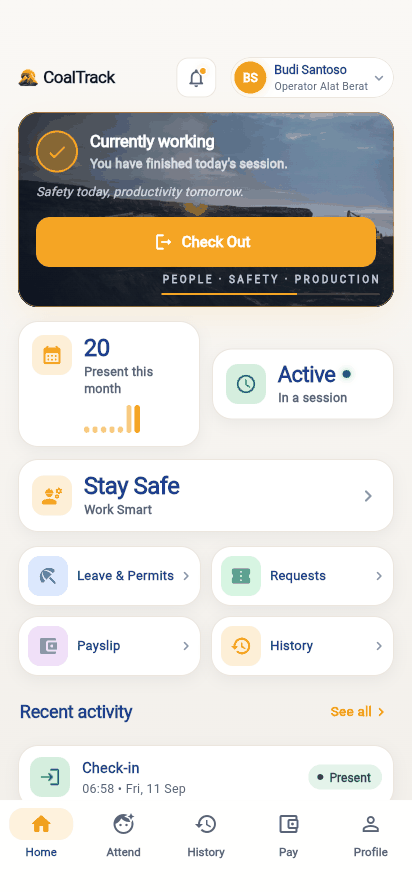

</div>

> **This is the public showcase / portfolio repository.** It contains the marketing deck at
> [coaltrack.id](https://coaltrack.id) and its screenshots. **The application source code is private.**

---

## What CoalTrack does

Attendance recaps in a mining operation are usually a spreadsheet problem: the phone clock can be
changed, a friend can clock in for you, and by the time payroll is assembled nobody can prove what
really happened. CoalTrack closes that loop end to end.

A worker clocks in with **real GPS + server time** in one tap — with or without signal. The
**server** decides, using its own clock, and writes an **append-only** event that nobody can edit
later. Verified hours roll into **work sessions**, work sessions into a **payroll engine** that
computes overtime, BPJS and **PPh21 TER**, and HR finalises the period in a **web panel** that
emails every **PDF payslip** and shows the same slip inside the employee's app.

One Flutter app for iOS and Android (the employee app), a Laravel 12 API, and a Filament 5 web
panel for HR.

---

## Key features

### Anti-fraud attendance — six layers

| | Layer | What it closes |
|---|---|---|
| 1 | **Server time** | Decisions use the server clock. Changing the phone clock does nothing. |
| 2 | **Device binding** | One approved device per employee. Buddy-punching from a colleague's phone is blocked. |
| 3 | **Immutable log** | Attendance events and reviews are append-only (enforced by a DB trigger). History cannot be rewritten. |
| 4 | **Trusted clock + work-hour windows** | The server stamps each check-in with its own trusted clock and enforces the work-hour window — even for check-ins captured offline, using the satellite time. |
| 5 | **Real GPS** | Real device location with mock-location detection. Recorded as audit evidence. |
| 6 | **Decision engine** | Accept / reject / flag on the evidence — and it fails safe. |

Attendance also works with **no signal**: the check-in is recorded on the phone with the real GPS
fix and the GPS-satellite time, kept in a local queue, and uploaded by itself the moment signal
returns — on app resume, every two minutes, and right after sign-in. Offline check-ins arrive
flagged with their reason; HR accepts, voids or restores them in the panel — never edits.

### HR web panel

HR works from a laptop, in Bahasa Indonesia, light or dark:

- **Dashboard** — shift board (who is on site now, who is late, whether the check-in window is open),
  14-day attendance trend, and an action queue of things waiting for a decision.
- **Attendance review** — every event with its risk signals; void or restore with a reason, never edit.
- **Work schedules** — check-in window, late threshold, auto-close, work days — saved as dated versions.
- **Devices** — approve or revoke the one phone each employee may use.
- **Employees & divisions** — directory, Excel import, and a *Verified* badge once the profile is
  complete and the phone approved.
- **Payroll** — payroll settings (BPJS contributions and caps, PPh21 TER tables, overtime divisor),
  salary grades per position, a what-if simulator, then run → finalise → email the PDF payslips,
  each locked with the employee's ID.

### Payroll

- Payslips computed from verified attendance — **BPJS**, **PPh21 TER**, overtime, allowances,
  night-shift, cut-off — configurable per company.
- The engine is written twice on purpose — PHP on the server, Dart in the app — and cross-tested so
  both produce identical figures.
- **Real payslips in the app** once HR finalises the period; **PDF payslip** by email; **bank
  transfer file** for the company's own cash-management portal.
- **Company rules are versioned, never retroactive**: payroll settings and work schedules are dated
  versions; a change applies from its effective date onward. A second-approver step is **→ next**.
- Anomaly checks before pay day (duplicate bank accounts, paid-with-no-attendance, abnormal
  overtime) are **→ next** — they are not in the product today.
- Money never passes through CoalTrack. Funds leave the company's own bank account.

### Payslip delivery — email from an authenticated sending domain

Payslips go out from CoalTrack's own **fully authenticated sending domain** (SPF, DKIM, DMARC), so
they land in the inbox rather than the spam folder and cannot be forged. There is no mail server for
the customer to run; sending from the **customer's own domain is available on request**. Each
employee receives a clean letter with the official **PDF payslip attached**, locked with their
employee ID. Sending is queued per employee; anyone without an email address is listed back to HR so
they get a printed slip instead of silence. Email runs alongside the in-app payslip and print.

### Roles, teams and tenancy

- **Employee** — attendance (online and offline), history, payslip, profile & security, verified badge.
  Leave & permits in the app are **→ next**.
- **Division head** — approves the exceptions for their own team.
- **HR** — the web panel: visibility across divisions, attendance review, payroll runs.
- **Super-admin** — full control of the organisation and its settings.
- **Multi-tenant, licensed** — one deployment serves several companies with isolated data, each on
  its own licence and its own configuration.

### Everywhere, in 7 languages

The employee app and this showcase speak English, Indonesian, Malay, Chinese, Arabic (full RTL),
Thai and Filipino — switchable at any time. Every screen is designed for both light and dark mode.
The HR panel is in Bahasa Indonesia.

---

## Screens

**Employee app**

| Home | Attend | History | Payslip |
|:---:|:---:|:---:|:---:|
| 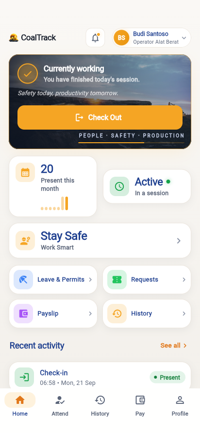 | 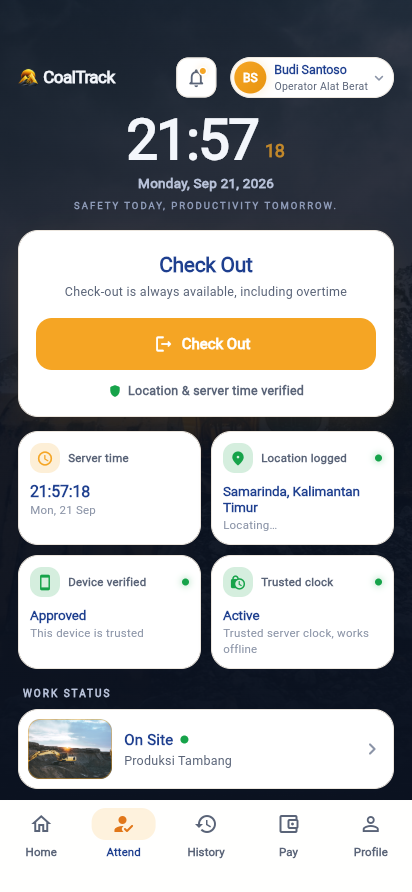 | 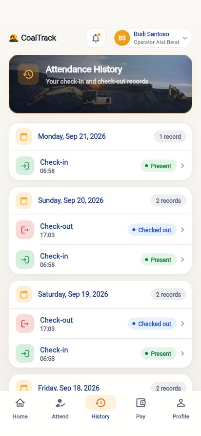 | 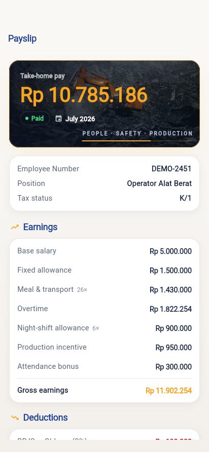 |

| Dark mode | Edit profile | Leave & permits · coming | Notifications · coming |
|:---:|:---:|:---:|:---:|
| 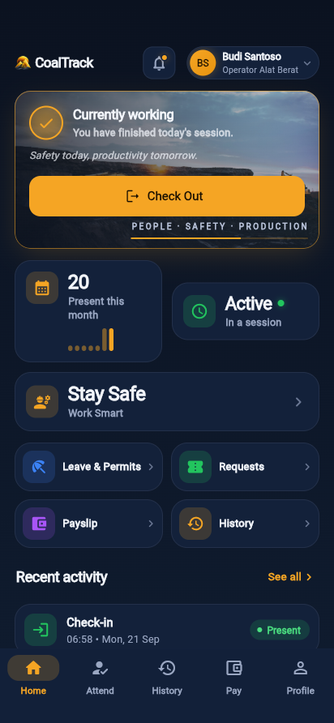 | 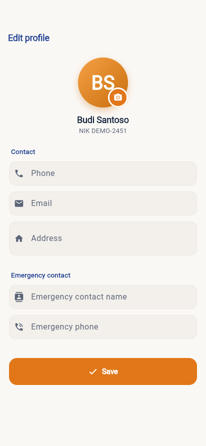 | 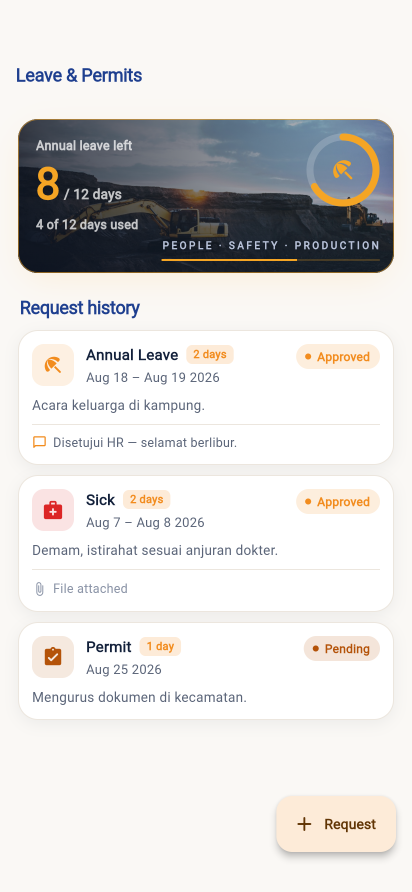 | 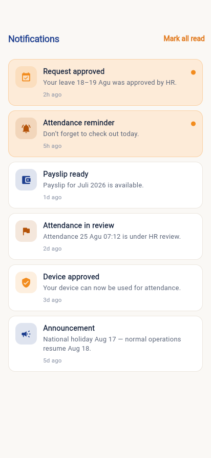 |

**HR web panel**

| Dashboard | Attendance review | Devices |
|:---:|:---:|:---:|
| 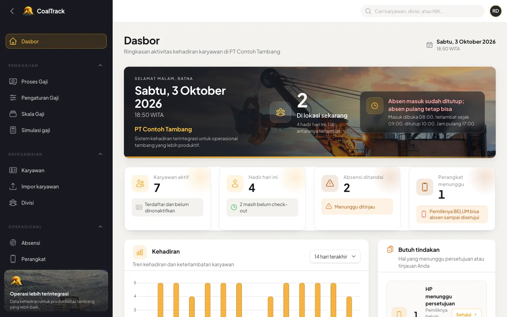 | 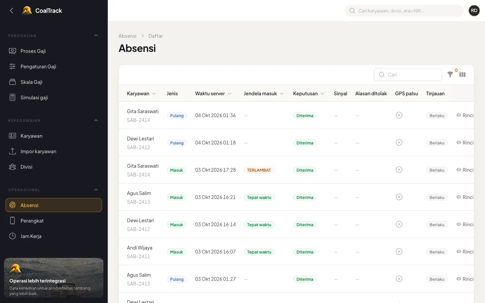 | 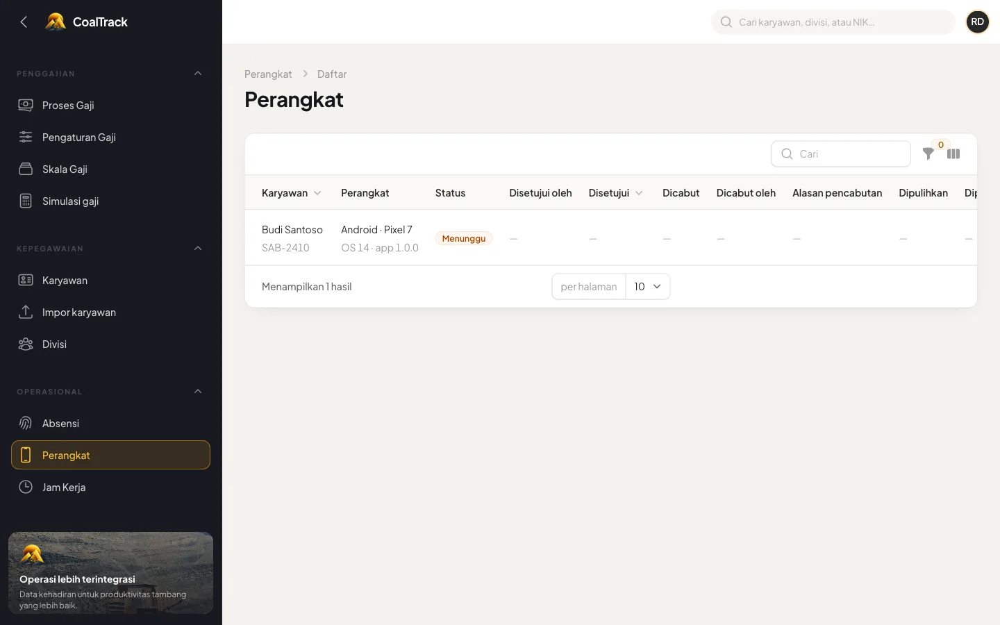 |

| Salary grades | Payroll runs & email slips | Run detail: cost summary & payslips |
|:---:|:---:|:---:|
| 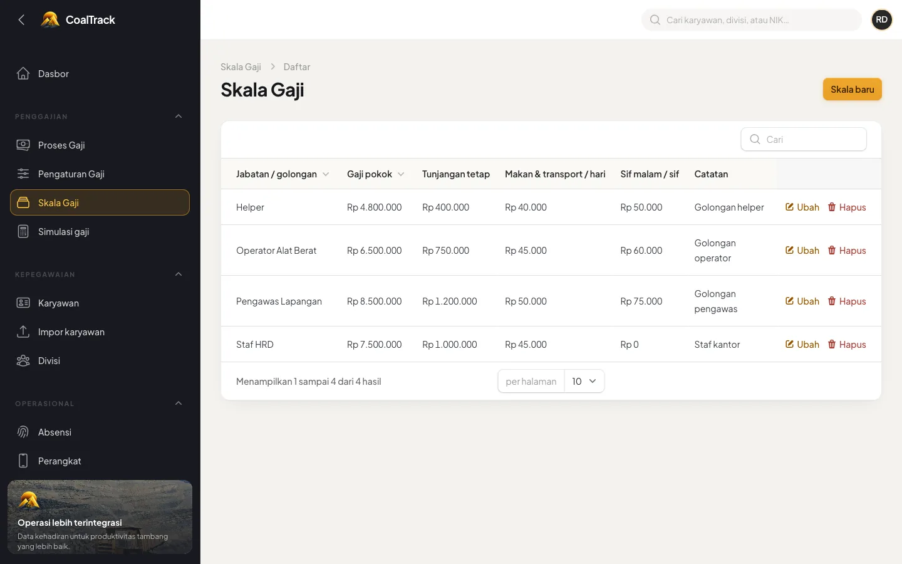 | 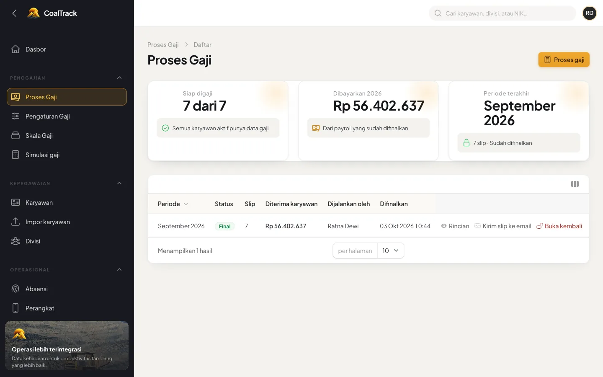 | 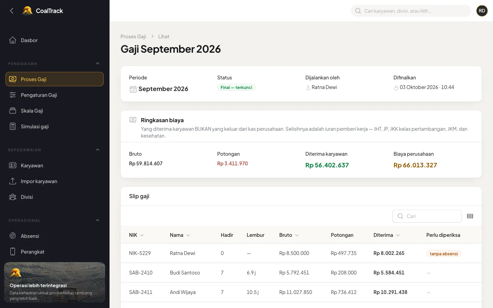 |

**Sign in once, then tap to unlock**

| First sign-in | Face ID / fingerprint | One-tap enable |
|:---:|:---:|:---:|
| 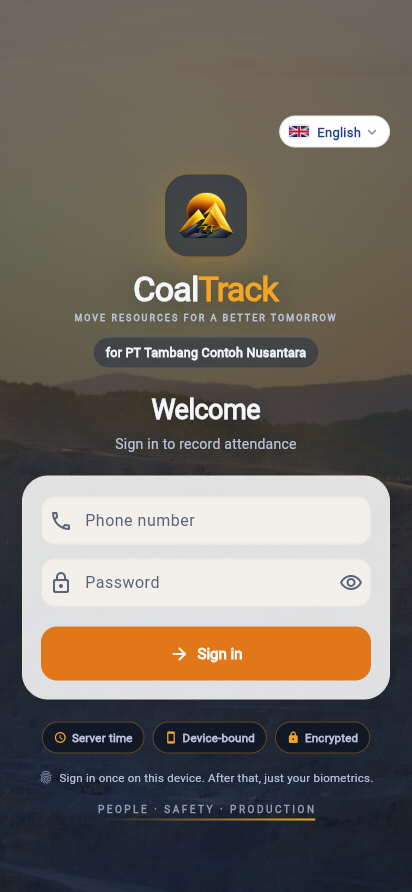 | 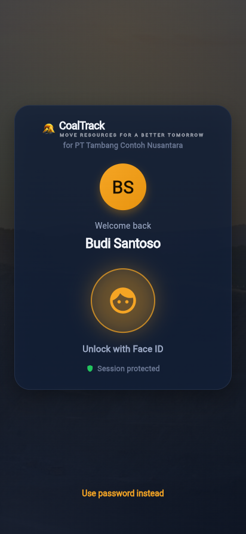 | 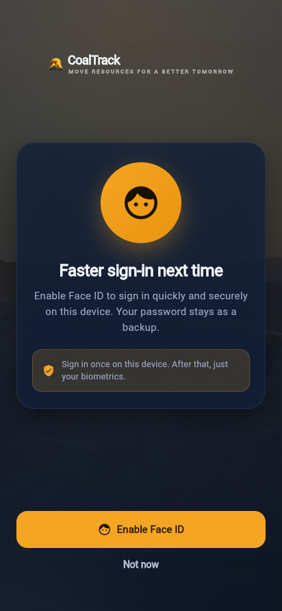 |

**Licensing &amp; payslip**

| Licence activation | Work schedules | Payslip PDF |
| :---: | :---: | :---: |
| 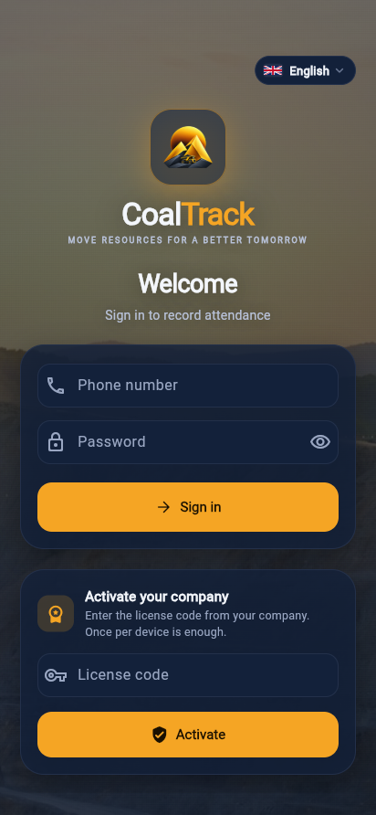 | 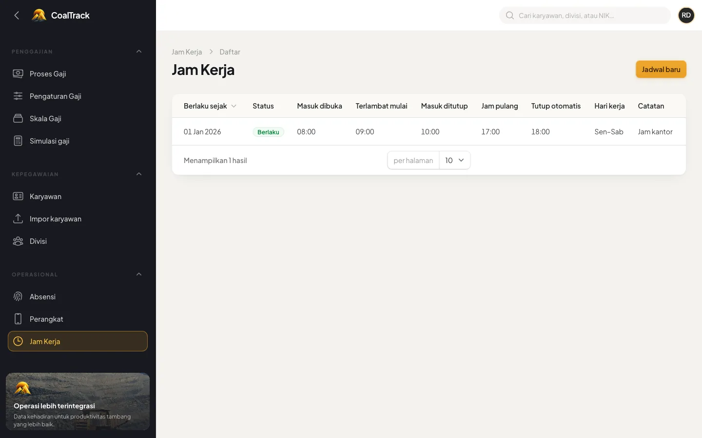 | 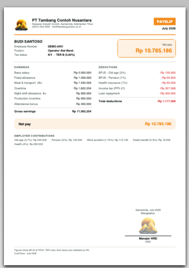 |
| A fresh install is neutral CoalTrack until the company licence code is entered — once per device. | Company rules are edited by the client's own HR in the panel; statutory rates stay locked. | Official payslip PDF, in the app and by email from an authenticated sending domain. |

First login uses a password on the device; after that one tap unlocks with Face ID / Touch ID (iOS)
or fingerprint (Android), adapted to each phone. Sessions are encrypted and device-bound, re-lock
when the app is backgrounded, and screenshots are blocked on sensitive screens.

---

## Manual / Excel vs CoalTrack

| Aspect | Manual / Excel | CoalTrack |
|---|---|---|
| Attendance time | ✕ Phone clock, manipulable | ✓ **Server time, tamper-proof** |
| Buddy-punching | ✕ Undetected | ✓ **One approved phone per employee + real GPS** |
| No signal on site | ✕ Written on paper, typed in later | ✓ **Captured offline, uploads itself** |
| Payroll recap | ✕ Days of manual work, error-prone | ✓ **Automatic from attendance** |
| Reporting | ✕ Monthly, late | ✓ **Real-time** |
| Tax & BPJS | ✕ Manual, error-prone | ✓ **PPh21 TER + BPJS automatic** |
| Payslip delivery | ✕ Printed and handed out | ✓ **In the app + PDF by email from an authenticated domain** |

---

## Pipeline

```
Attendance    ─▶  Server decision  ─▶  Work session   ─▶  Payroll engine   ─▶  Payslip
real GPS + time   server time,         verified hours     overtime, BPJS,      in-app + PDF
online/offline    immutable log        per day            PPh21 TER            by email
```

## Architecture

```
Flutter (employee app)     ─┐
                            ├─▶  Laravel 12 API (Sanctum)  ─▶  PostgreSQL 16 (append-only)
Filament 5 (HR web panel)  ─┘

Attendance (authoritative, immutable) → Work sessions → Payroll engine → Payslip
```

**Backend** PHP 8.3 · Laravel 12 · PostgreSQL 16 · Sanctum · Filament 5 · Pest (520 tests) · Docker · Caddy
**Mobile** Flutter (iOS / Android) · Riverpod · go_router · dio · geolocator · local_auth · flutter_secure_storage · 486 tests

---

## Status

| Area | Status |
|---|---|
| Backend + anti-fraud API (520 Pest tests) | ✅ done |
| HR web panel — dashboard, attendance review, work schedules, devices, employees, import | ✅ done |
| Mobile employee — attend online & offline, history, pay, profile, security, verified badge | ✅ done |
| Tap-to-unlock biometrics + app-wide screenshot protection | ✅ done |
| Payroll engine (BPJS, PPh21 TER, overtime) — same engine on server and app | ✅ done |
| Payroll in the panel — settings, salary grades, simulator, run → finalise → email PDF slips | ✅ done |
| Offline queue that uploads itself when signal returns | ✅ done |
| Leave & permits in the app | → next |
| Second-approver step on company payroll rules | → next |
| Anomaly checks before pay day (duplicate accounts, ghost employees, abnormal overtime) | → next |
| Push notifications | → next |

> **Honest note:** the pilot customer runs on CoalTrack's hosted backend (Singapore region).
> `demo.coaltrack.id` is a demo build with sample data that never calls a server.

---

## About this repository

| File | What it is |
|---|---|
| `index.html` | The showcase deck — 22 scroll-snap slides, 7 languages, no build step, no dependencies |
| `privacy.html`, `terms.html`, `support.html` | Legal & support pages (ID / EN) |
| `img/` | Product screenshots per language, HR panel captures (`panel-*.webp`), brand marks, OG image |
| `CNAME` | GitHub Pages custom domain (`coaltrack.id`) |

The deck's sales CTA reads a single constant near the top of the inline script in `index.html`:

```js
const SALES_WA = '…';   // WhatsApp number, international format, digits only (e.g. 62812…)
```

While it is empty the buttons fall back to `sales@coaltrack.id` and the demo link, so nothing breaks.

---

## Talk to us

- **Showcase** — [coaltrack.id](https://coaltrack.id)
- **Live demo** — [demo.coaltrack.id](https://demo.coaltrack.id)
- **Sales** — [sales@coaltrack.id](mailto:sales@coaltrack.id)
- **Support** — [support@coaltrack.id](mailto:support@coaltrack.id)

<div align="center"><sub>CoalTrack — a product of <a href="https://coaltrack.id">Ksatria Bintang Samudra</a> · application source code is private</sub></div>
